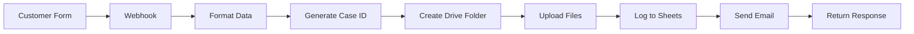

<div align="center">

# 🎫 Support Case Management Workflow

### Automated n8n workflow for managing customer support cases


[](https://opensource.org/licenses/MIT)
[](https://n8n.io)
[](http://makeapullrequest.com)

[Features](#-features) • [Installation](#-installation) • [API Usage](#-api-usage) • [Documentation](#-setup-guide)

---

</div>

An automated n8n workflow for managing customer support cases with Google Sheets integration, file uploads to Google Drive, and email confirmations.

## 📋 Overview

This workflow automates the entire support case lifecycle:
- Receives support requests via webhook
- Generates unique case IDs
- Creates organized folder structure in Google Drive
- Stores case data in Google Sheets
- Sends automated confirmation emails
- Handles file attachments

## 🏗️ Architecture

```
Webhook → Format Data → Create Folder → Upload Files → Log to Sheets → Send Email → Response
```

### Workflow Nodes

1. **Webhook Trigger** - Receives POST requests with case data
2. **Format Case Data** - Structures and validates incoming data
3. **Create Case Folder** - Creates Google Drive folder for attachments
4. **Loop Over Files** - Processes multiple file uploads
5. **Upload to Drive** - Stores files in the case folder
6. **Add to Google Sheets** - Logs case information
7. **Send Confirmation** - Emails customer with case details
8. **Response** - Returns success confirmation to caller

## 🚀 Features

- ✅ **Automatic Case ID Generation** - Format: `CASE-YYYY-MMDDHHMMSS`
- 📁 **File Management** - Organized folder structure per case
- 📊 **Centralized Tracking** - All cases logged in Google Sheets
- 📧 **Customer Notifications** - Automated confirmation emails
- 🌍 **Multi-market Support** - Configurable market selection
- 🔄 **Real-time Processing** - Instant case creation and response

## 📦 Prerequisites

### Required n8n Integrations

- **Google Drive OAuth2** - For file storage
- **Google Sheets OAuth2** - For case tracking
- **SMTP** - For email notifications

### Google Sheets Setup

Create a spreadsheet with the following columns:

| Column | Description |
|--------|-------------|
| Case ID | Unique identifier |
| Date | Timestamp |
| Support Type | Type of support request |
| Market | Geographic market |
| Name | Customer name |
| Email | Customer email |
| Phone | Customer phone |
| Company | Company name |
| Serial Number | Product serial |
| Article Number | Product article number |
| Product Model | Product model |
| Description | Issue description |
| Files Folder | Google Drive link |
| Status | Case status |

## 🔧 Installation

<details>
<summary><b>📥 Step 1: Import Workflow</b></summary>

### Via Command Line

```bash
# Copy the workflow JSON file to your n8n workflows directory
cp workflows/support-case-workflow.json /path/to/n8n/workflows/
```

### Via n8n UI
1. Go to **Workflows** → **Import**
2. Select `support-case-workflow.json`
3. Click **Import**

</details>

<details>
<summary><b>🔐 Step 2: Configure Credentials</b></summary>

###  Google Drive OAuth2
1. Navigate to **Credentials** → **New**
2. Select **Google Drive OAuth2 API**
3. Follow the OAuth setup process
4. Save as "Google Drive Account"

###  Google Sheets OAuth2
1. Navigate to **Credentials** → **New**
2. Select **Google Sheets OAuth2 API**
3. Follow the OAuth setup process
4. Save as "Google Sheets Account"

### 📧 SMTP Email
1. Navigate to **Credentials** → **New**
2. Select **SMTP**
3. Configure your email server settings
4. Save as "SMTP Account"

</details>

<details>
<summary><b>⚙️ Step 3: Update Configuration</b></summary>

Update the following in the workflow:

```javascript
// Google Sheets Node - documentId
"documentId": "YOUR_GOOGLE_SHEET_ID"

// Email Node - fromEmail
"fromEmail": "your-support@example.com"
```

</details>

<details>
<summary><b>✅ Step 4: Activate Workflow</b></summary>

1. Open the imported workflow
2. Click **Active** toggle in the top right
3. Note the webhook URL for API calls

</details>

## 📡 API Usage

### Endpoint

```
POST https://your-n8n-instance.com/webhook/support-case
```

### Request Body

```json
{
  "supportType": "Technical Support",
  "name": "John Doe",
  "email": "john.doe@example.com",
  "phone": "+46701234567",
  "company": "Acme Corp",
  "serialNumber": "SN123456789",
  "articleNumber": "ART-001",
  "productModel": "Model X",
  "description": "Device won't start after firmware update",
  "market": "SE",
  "files": [
    {
      "filename": "error-log.txt",
      "data": "base64EncodedFileContent"
    }
  ]
}
```

### Response

```json
{
  "success": true,
  "caseId": "CASE-2025-11231430",
  "message": "Your support case has been created successfully"
}
```

## 📊 Data Flow



## 🔐 Security Considerations

- ✅ Use OAuth2 for Google services
- ✅ Validate webhook payload structure
- ✅ Sanitize user input in emails
- ✅ Use HTTPS for webhook endpoints
- ✅ Implement rate limiting (n8n node settings)
- ✅ Store credentials securely in n8n

## 🛠️ Customization

### Modify Case ID Format

Edit the **Format Case Data** node:

```javascript
// Current format: CASE-YYYY-MMDDHHMMSS
"value": "=CASE-{{ $now.year }}-{{ $now.format('MMDDHHmmss') }}"

// Alternative format example: SUP-YYYYMMDD-XXXX
"value": "=SUP-{{ $now.format('YYYYMMDD') }}-{{ Math.floor(Math.random() * 10000) }}"
```

### Add Email Templates

Edit the **Send Confirmation Email** node to customize HTML:

```html
<h2>Thank you for contacting us!</h2>
<p>Your support case has been created successfully.</p>
<p><strong>Case ID:</strong> {{ caseId }}</p>
<!-- Add your custom branding here -->
```

### Add More Fields

1. Update webhook to accept new fields
2. Add fields in **Format Case Data** node
3. Update Google Sheets columns
4. Modify email template if needed

## 📈 Monitoring & Troubleshooting

### ✅ Check Workflow Executions

1. Go to **Executions** in n8n
2. Filter by workflow name
3. Review success/failure rates

### ⚠️ Common Issues

<details>
<summary><b>Files not uploading to Google Drive</b></summary>

**Solution:**
- Check Google Drive credentials and folder permissions
- Verify OAuth2 token is valid
- Ensure binary data is properly formatted

</details>

<details>
<summary><b>Google Sheets not updating</b></summary>

**Solution:**
- Verify Sheet ID and column names match exactly
- Check OAuth2 credentials
- Ensure proper write permissions

</details>

<details>
<summary><b>Emails not sending</b></summary>

**Solution:**
- Confirm SMTP settings and credentials
- Check spam folders
- Verify email server allows connections

</details>

<details>
<summary><b>Webhook timeout</b></summary>

**Solution:**
- Enable "Response" node before long operations
- Increase timeout in n8n settings
- Consider async processing

</details>

## 🧪 Testing

<div align="center">

[](examples/)
[](examples/curl-examples.sh)

</div>

### 🔧 Test with cURL

```bash
curl -X POST https://your-n8n-instance.com/webhook/support-case \
  -H "Content-Type: application/json" \
  -d '{
    "supportType": "Technical Support",
    "name": "Test User",
    "email": "test@example.com",
    "phone": "+46701234567",
    "description": "Test case creation",
    "market": "SE"
  }'
```

### 📮 Test with Postman

1. Import the included `postman_collection.json`
2. Update the webhook URL
3. Run the "Create Support Case" request

## 🔗 Quick Links

<div align="center">

| Resource | Description |
|----------|-------------|
| 📖 [Setup Guide](docs/SETUP.md) | Complete installation instructions |
| 📝 [Changelog](CHANGELOG.md) | Version history and updates |
| 🧪 [Test Examples](examples/) | API request examples and cURL scripts |
| 📄 [License](LICENSE) | MIT License |

</div>

## 📝 Support Types

- Technical Support
- Product Information
- Warranty Claim
- Parts Request
- Service Request
- General Inquiry

## 🌍 Supported Markets

<div align="center">

| Market | Country |
|--------|----------|
| 🇸🇪 SE | Sweden |
| 🇳🇴 NO | Norway |
| 🇩🇰 DK | Denmark |
| 🇫🇮 FI | Finland |
| 🇩🇪 DE | Germany |
| 🇬🇧 UK | United Kingdom |
| 🇺🇸 US | United States |

</div>

## 🤝 Contributing

<div align="center">

[](http://makeapullrequest.com)
[](https://github.com/yourusername/tur-n8n-feedbackagent/issues)

Feel free to submit issues or pull requests to improve this workflow!

</div>

## 📄 License

MIT License - Feel free to use and modify for your needs.

## 📞 Support

For questions about this workflow:

<div align="center">

[](https://github.com/yourusername/tur-n8n-feedbackagent/issues)
[](https://community.n8n.io)
[](https://docs.n8n.io)

</div>

---

<div align="center">

### Built with ❤️ using


**n8n Workflow Automation**

[](https://n8n.io)

⭐ Star this repo if you find it helpful!

</div>
