<div align="center">

# 🤖 AI Feedback Agent - n8n Workflow

### Intelligent conversational feedback collection powered by AI


[](https://opensource.org/licenses/MIT)
[](https://n8n.io)
[](https://azure.microsoft.com/en-us/products/ai-services/openai-service)
[](http://makeapullrequest.com)

[Features](#-features) • [How It Works](#-how-it-works) • [Installation](#-installation) • [API Usage](#-api-usage)

---

</div>

**Transform feedback collection from tedious surveys into intelligent conversations.** This AI-powered workflow engages users in natural dialogue, asks thoughtful follow-up questions, and automatically extracts structured, actionable insights - all while adapting to the user's language and context.

## 💡 The Problem

Traditional feedback collection suffers from:
- 📋 **Survey fatigue** - Users abandon long forms
- 🤷 **Shallow responses** - One-word answers don't explain "why"
- 📊 **Unstructured data** - Hours spent categorizing free-text
- 🌍 **Language barriers** - Manual translation needed
- ⏰ **Time-consuming analysis** - Hard to prioritize what matters

## ✨ The Solution

An AI agent that automates the entire feedback lifecycle:

```
User feedback → AI conversation → Structured insights → Google Sheets → Actionable prioritization
```

### Key Benefits

- 💬 **Natural conversations** - Users feel heard, not surveyed
- 🎯 **Intelligent follow-ups** - AI asks clarifying questions to understand impact
- 🌍 **Auto language detection** - Responds in Swedish, English, etc.
- 📊 **Structured output** - Type, category, priority, impact automatically extracted
- ⚡ **Save time** - Focus on solutions, not data processing

## 🚀 Features

<table>
<tr>
<td width="50%">

### 🤖 AI-Powered Conversation
- GPT-4 powered intelligent dialogue
- Understands context and intent
- Asks up to 2 relevant follow-up questions
- Knows when to stop and summarize

</td>
<td width="50%">

### 🌍 Multilingual Support
- Auto-detects Swedish, English, etc.
- Responds in user's language
- Mirrors tone and formality
- Natural, human-like responses

</td>
</tr>
<tr>
<td width="50%">

### 📊 Structured Insights
- Automatic categorization (bug/feature/praise)
- Priority scoring (high/medium/low)
- Impact analysis
- Context extraction
- Actionable recommendations

</td>
<td width="50%">

### 🔄 Seamless Integration
- RESTful webhook API
- Conversation memory (10 messages)
- Google Sheets logging
- CORS enabled for web apps
- Real-time responses

</td>
</tr>
</table>

## 🎯 How It Works

```mermaid
graph LR
    A[👤 User] -->|Sends message| B[🌐 Webhook]
    B --> C[🧠 Language Detection]
    C --> D[🤖 AI Agent]
    D -->|Memory| E[💾 Window Buffer]
    D -->|LLM| F[🧬 GPT-4]
    D --> G[📝 Format Response]
    G -->|Chat| H[💬 Return to User]
    G -->|Summary| I[✅ Check if Complete]
    I -->|Yes| J[📊 Save to Sheets]
    J --> H
```



### Conversation Flow Example

**User (Swedish):** *"Kundvagnen töms ibland när jag går tillbaka till startsidan."*  
*(Translation: "The cart empties sometimes when I go back to the homepage.")*

**AI Agent:** *"Oj, det låter frustrerande. Hur ofta händer det ungefär?"*  
*(Translation: "Oh, that sounds frustrating. How often does it happen approximately?")*

**User:** *"Kanske 2-3 gånger i veckan när jag handlar."*  
*(Translation: "Maybe 2-3 times a week when I shop.")*

**AI Agent:** *"Tack, det hjälper mycket! Jag har allt jag behöver nu."*  
*(Translation: "Thanks, that helps a lot! I have everything I need now.")*

**Structured Output Saved:**
```json
{
  "summary": "Kundvagnen töms ibland när användaren går tillbaka till startsidan. Händer 2-3 gånger per vecka.",
  "type": "bug",
  "category": "order",
  "impact": "Fördröjer beställningar; användaren måste lägga till produkter igen.",
  "frequency": "often",
  "context": "cart / homepage navigation",
  "suggested_action": "Fix session handling for cart persistence when navigating to homepage.",
  "priority": "medium",
  "metadata": { "language": "sv", "followUpRequired": false }
}
```

## 🛠️ Tech Stack

<div align="center">

| Component | Technology | Purpose |
|-----------|------------|---------|
| **AI Engine** |  Azure OpenAI (GPT-4) | Natural language understanding & generation |
| **Automation** |  n8n + LangChain | Workflow orchestration & AI agent framework |
| **Memory** | 💾 Window Buffer Memory | Maintains conversation context (10 messages) |
| **Storage** |  Google Sheets | Structured feedback database |
| **API** |  RESTful Webhook | HTTP API for client integration |

</div>

## 📥 Installation

<details>
<summary><b>📋 Prerequisites</b></summary>

- n8n instance (self-hosted or cloud)
- Azure OpenAI account with GPT-4 access
- Google Sheets API credentials
- Basic knowledge of webhooks

</details>

<details>
<summary><b>Step 1: Import Workflow</b></summary>

### Via n8n UI
1. Copy the workflow JSON from `workflows/feedback-agent-workflow.json`
2. In n8n, go to **Workflows** → **Import from File** or **Import from URL**
3. Paste the JSON content
4. Click **Import**

</details>

<details>
<summary><b>Step 2: Configure Credentials</b></summary>

### Azure OpenAI
1. Go to **Credentials** → **New**
2. Select **Azure OpenAI**
3. Enter:
   - API Key
   - Resource Name
   - Deployment ID (e.g., `gpt-4`)
4. Save as "Azure OpenAI Account"

### Google Sheets OAuth2
1. Go to **Credentials** → **New**
2. Select **Google Sheets OAuth2 API**
3. Complete OAuth flow
4. Save as "Google Sheets Account"

</details>

<details>
<summary><b>Step 3: Set Up Google Sheet</b></summary>

Create a Google Sheet with these columns:

| Timestamp | SessionID | Type | Category | Summary | Impact | Priority | Context | Suggested_Action | Frequency | Language |
|-----------|-----------|------|----------|---------|--------|----------|---------|-----------------|-----------|----------|

Update the **Google Sheets** node in the workflow with your Sheet ID.

</details>

<details>
<summary><b>Step 4: Activate & Test</b></summary>

1. Click **Active** to enable the workflow
2. Copy the webhook URL (shown in the Webhook node)
3. Test with a POST request:

```bash
curl -X POST YOUR_WEBHOOK_URL \
  -H "Content-Type: application/json" \
  -d '{
    "message": "The search is really slow",
    "language": "en"
  }'
```

</details>

## 🔌 API Usage

### Endpoint

```
POST https://your-n8n-instance.com/webhook/feedback-agent/v1
```

### Request Body

```json
{
  "message": "User feedback message here",
  "sessionId": "optional-session-id",
  "conversationHistory": [
    { "role": "user", "content": "Previous message" },
    { "role": "assistant", "content": "Previous response" }
  ],
  "language": "auto"
}
```

### Parameters

| Field | Type | Required | Description |
|-------|------|----------|-------------|
| `message` | string | ✅ Yes | User's feedback message |
| `sessionId` | string | ❌ No | Session identifier (auto-generated if omitted) |
| `conversationHistory` | array | ❌ No | Previous conversation context (max 10 messages) |
| `language` | string | ❌ No | `auto`, `sv`, `en`, etc. (default: `auto`) |

### Response

#### Chat Response (ongoing conversation)
```json
{
  "mode": "chat",
  "displayMessage": "Can you tell me more about when this happens?",
  "conversationHistory": [...]
}
```

#### Summary Response (conversation complete)
```json
{
  "mode": "summary",
  "displayMessage": "✅ Thank you for your feedback!\n\nWe have received...",
  "fullSummary": {
    "summary": "User reports slow search performance...",
    "type": "bug",
    "category": "performance",
    "impact": "Users wait 5-10 seconds for results",
    "frequency": "always",
    "context": "search / product listing",
    "suggested_action": "Optimize search indexing and caching",
    "priority": "high",
    "metadata": { "language": "en", "followUpRequired": false }
  }
}
```

## 📊 Feedback Categories

The AI automatically categorizes feedback into:

### Types
- 🐛 **bug** - Something is broken or not working
- ✨ **feature** - New capability or improvement request
- 👍 **praise** - Positive feedback
- ❓ **other** - Uncategorized

### Categories
- 🛒 **order** - Shopping cart, checkout, order management
- 🔍 **search** - Search functionality, filters
- ⚡ **performance** - Speed, loading times
- 📦 **product_data** - Product information, images, specs
- 🎨 **ux** - User experience, design, navigation
- 🔧 **other** - Other areas

### Priority Levels
- 🔴 **high** - Blocks work/orders or affects many users
- 🟡 **medium** - Noticeable friction, but work continues
- 🟢 **low** - Suggestion, nice-to-have, or positive remark

## 🎨 Customization

### Modify AI Behavior

Edit the **AI Agent** node's system message to:
- Change conversation style (more formal/casual)
- Adjust number of follow-up questions
- Add domain-specific context
- Customize categories and priorities

### Change Languages

The agent supports any language. To add more:
```javascript
// In "Parse & Detect Language" node
const swedishWords = ['är', 'och', 'för', ...];
const germanWords = ['ist', 'und', 'für', ...];
// Add detection logic
```

### Integrate with Other Tools

Replace **Google Sheets** with:
- Slack notifications
- Jira ticket creation
- Email reports
- Custom databases

## 📈 Analytics & Insights

Once feedback is collected in Google Sheets, you can:

1. **Pivot Tables** - Group by type, category, priority
2. **Charts** - Visualize trends over time
3. **Dashboards** - Use Google Data Studio / Looker
4. **Export** - CSV for deeper analysis in Excel/Python

### Example Queries

- "What are the top 3 high-priority bugs this month?"
- "How many users mentioned 'slow search'?"
- "What's the ratio of bugs vs. features requested?"

## 🔐 Security & Privacy

- ✅ No personally identifiable information (PII) is stored
- ✅ CORS enabled for web integration
- ✅ Session IDs are anonymized
- ✅ Azure OpenAI data processing compliant with GDPR
- ⚠️ Consider adding rate limiting for production use
- ⚠️ Review and redact sensitive information before analysis

## 🧪 Testing

### Test with cURL

```bash
# First message
curl -X POST YOUR_WEBHOOK_URL \
  -H "Content-Type: application/json" \
  -d '{
    "message": "The checkout process is confusing",
    "language": "en"
  }'

# Follow-up message
curl -X POST YOUR_WEBHOOK_URL \
  -H "Content-Type: application/json" \
  -d '{
    "sessionId": "session_123",
    "message": "I keep getting error messages when I try to pay",
    "conversationHistory": [
      {"role": "user", "content": "The checkout process is confusing"},
      {"role": "assistant", "content": "Can you describe what happens?"}
    ]
  }'
```

### Integration Example (JavaScript)

```javascript
async function submitFeedback(message, sessionId = null, history = []) {
  const response = await fetch('YOUR_WEBHOOK_URL', {
    method: 'POST',
    headers: { 'Content-Type': 'application/json' },
    body: JSON.stringify({
      message,
      sessionId,
      conversationHistory: history,
      language: 'auto'
    })
  });
  
  const data = await response.json();
  
  if (data.mode === 'chat') {
    // Continue conversation
    console.log('Agent:', data.displayMessage);
  } else if (data.mode === 'summary') {
    // Conversation complete
    console.log('Summary:', data.fullSummary);
  }
  
  return data;
}
```

## 🌟 Use Cases

### B2B Portals
- Collect feedback from business users
- Understand pain points in ordering workflows
- Prioritize feature requests

### SaaS Products
- Continuous product feedback loop
- User sentiment tracking
- Feature validation

### E-commerce
- Checkout experience insights
- Product discovery improvements
- Mobile app feedback

### Internal Tools
- Employee experience feedback
- IT helpdesk insights
- Process improvement suggestions

## 🗺️ Roadmap

- [ ] Multi-language UI components (React/Vue widget)
- [ ] Sentiment analysis scoring
- [ ] Automated email digests for product teams
- [ ] Integration with Jira/Linear/GitHub Issues
- [ ] Dashboard for real-time feedback monitoring
- [ ] A/B testing for different AI prompts
- [ ] Voice input support
- [ ] Analytics API for external BI tools

## 🤝 Contributing

<div align="center">

[](http://makeapullrequest.com)
[](https://github.com/emilingemarkarlsson/tur-n8n-feedbackagent/issues)

Contributions are welcome! Feel free to:
- 🐛 Report bugs
- 💡 Suggest features
- 📖 Improve documentation
- 🔧 Submit pull requests

</div>

## 📄 License

MIT License - Feel free to use and modify for your needs.

## 📞 Support

<div align="center">

[](https://github.com/emilingemarkarlsson/tur-n8n-feedbackagent/issues)
[](https://community.n8n.io)
[](https://docs.n8n.io)

</div>

---

<div align="center">

### Built with ❤️ using


**n8n + Azure OpenAI + LangChain**

[](https://n8n.io)
[](https://azure.microsoft.com/en-us/products/ai-services/openai-service)

⭐ Star this repo if you find it helpful!

*Transform feedback into insights, not just data.*

</div>
